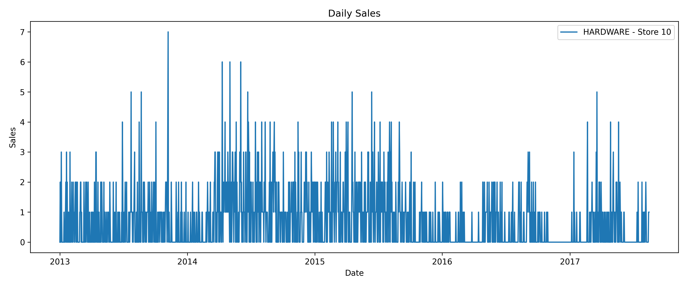
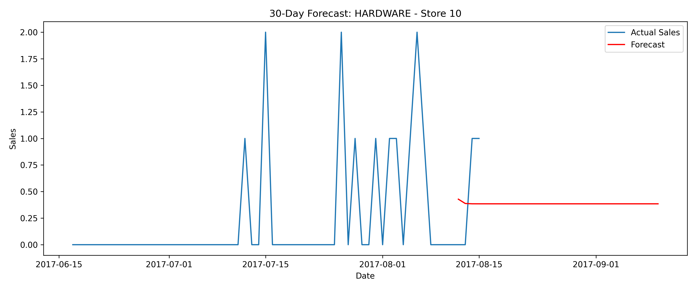

# Retail Product Demand Forecasting using ARIMA

This project focuses on forecasting daily sales for different product families in retail stores using the ARIMA model — a classic time series forecasting technique. Built using Python, the project enables interactive forecasting based on store and product family selection, and visualizes future demand to support supply chain decisions.

---

## 🎯 Project Objective

> To build a robust time series forecasting pipeline that predicts future sales using real-world retail data, enabling better demand planning and inventory control.

---

## 🧠 What I Learned

Through this project, I gained hands-on experience in:

- Time series data analysis and preparation
- Understanding stationarity and applying differencing
- Using the Augmented Dickey-Fuller (ADF) test
- Building and tuning ARIMA models with `statsmodels`
- Visualizing trends and forecast results
- Writing modular and interactive Python scripts
- Saving outputs like plots and forecast data to files

This project also helped reinforce key concepts in data science, statistical modeling, and Python programming.

---

## 🧩 Core Concepts Covered

- Time Series Forecasting
- Stationarity and Differencing
- ADF Test
- ARIMA (AutoRegressive Integrated Moving Average)
- Data Filtering and Indexing
- Plotting with Matplotlib
- Saving model outputs and visualizations

---

## 🔄 Project Workflow

1. Load and preprocess the dataset
2. Display available store numbers and product families
3. Accept user input for store and family
4. Filter and sort time series data
5. Run ADF test and apply differencing if needed
6. Train ARIMA(1,1,1) model
7. Forecast sales for the next 30 days
8. Generate and save sales and forecast plots
9. Export forecast data to CSV

---

## ⚙️ Technologies Used

- **Python**
- **Pandas** — data handling
- **Matplotlib** — plotting
- **Statsmodels** — ARIMA modeling
- **Numpy** — numerical operations

---

## 📁 Dataset

- **Source**: [Kaggle - Store Sales Time Series Forecasting](https://www.kaggle.com/competitions/store-sales-time-series-forecasting/data)
- **Filename**: `train.csv`
- **Key Columns**:
  - `date`
  - `store_nbr`
  - `family`
  - `sales`

---

## 📊 Example Run & Outputs

When the script is executed:

```bash
python forecasting.py
```

You will be prompted to:

1. View the list of available stores and product families
2. Select a store number (e.g., 10)
3. Select a product family (e.g., HARDWARE)

The script will then:

- Check for stationarity using ADF test
- Apply differencing if needed
- Train an ARIMA(1,1,1) model
- Forecast the next 30 days
- Save and display the following:

### ✅ Raw Sales Plot

Shows historical daily sales for the selected store and family.



### ✅ Forecasted Sales Plot

Displays the 30-day forecast overlaid on recent actual sales.



### ✅ Forecast CSV Output

Saved as `forecast_store<store>_<family>.csv`, for example:

**`forecast_store10_hardware.csv`**

| Date       | Forecasted_Sales |
|------------|------------------|
| 2017-08-16 | 95.67            |
| 2017-08-17 | 94.02            |
| ...        | ...              |

---

## 🚀 How to Run the Project

### 1. Install Dependencies

```bash
pip install pandas matplotlib statsmodels
```

### 2. Place your dataset

Ensure `train.csv` is in the same directory as the script.

### 3. Run the script

```bash
python forecasting.py
```

---


## 📌 Final Notes

This project helped bridge theoretical knowledge of time series forecasting with practical implementation. It demonstrates the entire forecasting pipeline from data exploration to model training and visualization, making it a great addition to any data science portfolio.

---